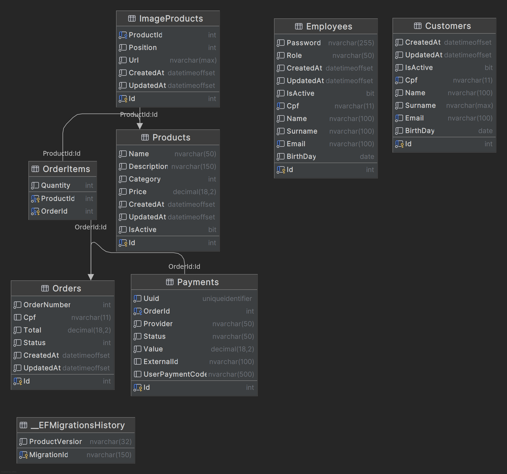
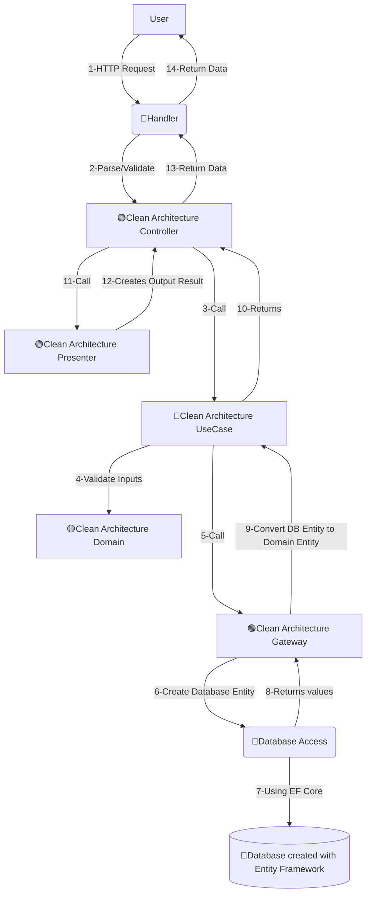
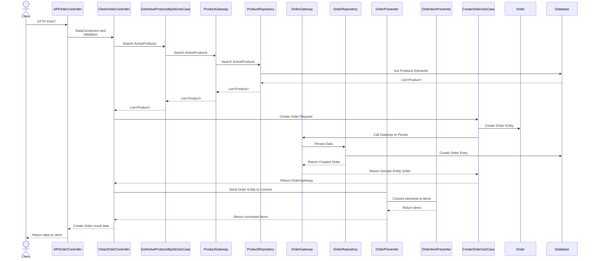
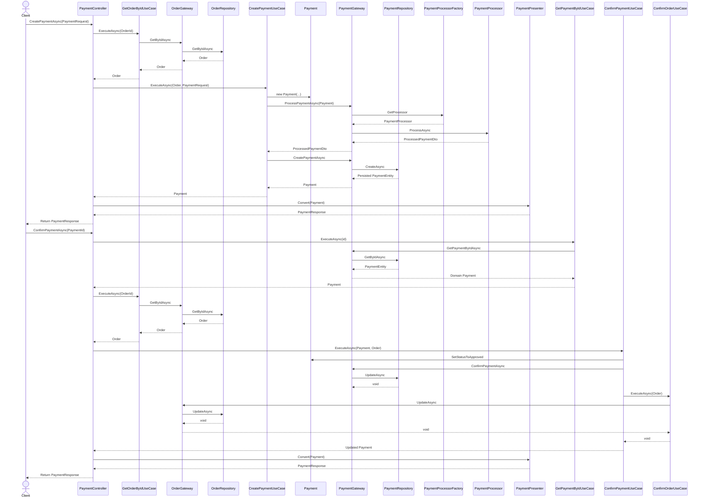

# Tech Challenge - Fast Food API - Fase 3 - Grupo 118

# Membros do Grupo
- Sabrina Cardoso de Oliveira
  - **Matrícula**: RM363507
  - **Usuário Discord**: sah.mdo
- Tiago Cristiano Koch
  - **Matrícula**: RM361415
  - **Usuário Discord**: tiagokoch0076
- Tiago Victor de Oliveira
  - **Matrícula**: RM364588
  - **Usuário Discord**: oliveirad.tiago
- Túlio Henrique de Paula Rezende
  - **Matrícula**: RM360982
  - **Usuário Discord**: tuliomamute
- Vinícius Rossmann Nunes
  - **Matrícula**: RM362963
  - **Usuário Discord**: _viniciusnunes

# Tecnologias utilizadas
- **Linguagem**: C# / ASP.NET Core Web Api (dotnet 8)
- **Banco de Dados**: SQL Server 2022
- **ORM**: Entity Framework Core
  - **Migration** sendo aplicada no startup da aplicação
- **Controle de Versão**: GitHub
- **Kubernetes**
  - **Helm**: Utilizado para facilitar o deploy da aplicação e do banco de dados
  - **Docker**: Utilizado para containerização da aplicação e do banco de dados
  - **Docker Desktop/Rancher Desktop**: Utilizados para simular o ambiente de produção localmente
- **Terraform**: criação da infraestrutura
  - **Terraform Cloud**: gerenciamento dos estados da infraestrutura
- **Github Actions**: mecanismos de execução de buidls e deploys

Escolhas efetuadas de acordo com a familiariade de todo o grupo para acelerarmos o tempo de desenvolvimento e focarmos nas atividades fundamentais

Com isso deve ser gerado um token que deve ser fornecido no canto superior direito clicando no botão Authorize, adicionar a palavra Bearer e colar o conteúdo da resposta do endpoint Login, Ex: Bearer eyJhbGciOiJIUzI1NiIsI e clicar em Authorize. Após isso fechar clicar em close e seu usuário estará autenticado e com acesso a todos os endpoints da aplicação.

# Vídeo de Demonstração
Para facilitar a visualização do funcionamento da API, foi criado um vídeo de demonstração que mostra o fluxo de criação de pedidos, incluindo a autenticação e o uso do Mercado Pago para pagamento via Pix. Para assistir, clique na imagem abaixo:

[](https://youtu.be/FkBYzvneXAM)

# Collection do Postman
Para facilitar o teste dos endpoints da API, foi criada uma que contém todos os endpoints disponíveis, incluindo os de autenticação e os de criação de pedidos.

[](Tech-Challenge-118-Fase2.postman_collection.json)

# Como executar o projeto
Elaboramos os Helm Charts para serem executados em um cluster Kubernetes de maneira local. Então, para executar o projeto, é necessário ter instalado ferramentas para execução de um cluster local, como por exemplo:
- [Docker Desktop](https://www.docker.com/products/docker-desktop/)
- [Rancher Desktop](https://rancherdesktop.io/)
- [Minikube](https://minikube.sigs.k8s.io/docs/)

# Helm - SQL Server

Para facilitar a instalação do SQL Server em um cluster Kubernetes, foi criado um [chart Helm](https://helm.sh/docs/intro/install/). O chart inclui as configurações necessárias para o banco de dados, como usuário, senha e porta.
Comando de instalação (a partir da pasta raiz do projeto)
```shell
helm upgrade --install sqlserver infra/helm/devsqlchart
```

Dados para acesso ao banco de dados

- **Usuário**: sa
- **Senha**: Mssql!Passw0rd
- **Host**: localhost, 31390 (porta do serviço NodePort)

Connection string de exemplo:
```plaintext
Data Source=localhost,31390;Database=TechChallengeFastFoodFase2;Integrated Security=false;User ID=sa;Password=Mssql!Passw0rd;TrustServerCertificate=true;Max Pool Size=200;Min Pool Size=10;Connection Timeout=30;
```

## Estrutura do Banco de Dados

Abaixo segue a modelagem do nosso banco de dados, contendo como as entidades se relacionam.



## MER - Conceitual

Abaixo segue o diagrama conceitual contendo o fluxograma da ações na aplicação.


## Boas práticas adotadas 

A aplicação faz uso de migrações do Entity Framework (EF) demonstrando várias boas práticas de desenvolvimento de banco de dados e migrações. Ele gera script automaticamente pelo EF Core, o que já garante uma estrutura robusta e segura.

## Boas Práticas Identificadas

---

### Transações e Integridade
O script inicial de migração utiliza uma **transação** (`BEGIN TRANSACTION` e `COMMIT`). Isso é crucial para garantir a integridade do banco de dados. Se qualquer comando dentro da transação falhar, a transação inteira é revertida (rollback), evitando um estado inconsistente do banco de dados.

### Verificação de Existência
O script inicial de migração começa verificando se a tabela `[__EFMigrationsHistory]` já existe usando `IF OBJECT_ID(N'[__EFMigrationsHistory]') IS NULL`. Isso impede erros caso o script seja executado mais de uma vez, tornando-o **idempotente**. Essa é uma prática essencial para scripts de migração.

### Colunas de Controle
As tabelas `Customers`, `Employees`, `Orders`, `Products`, e `ImageProducts` incluem colunas de controle, como `CreatedAt` e `UpdatedAt`. Essas colunas são fundamentais para auditoria e rastreamento de mudanças, e a utilização de **`SYSDATETIMEOFFSET()`** como valor padrão garante que a data e hora de criação e atualização sejam registradas automaticamente no momento da inserção.

### Padronização de Nomenclatura
Para a nomenclatura segue uma convenção de nomenclatura clara para tabelas (`[NomeDaTabela]`), colunas (`[NomeDaColuna]`), e chaves (`[PK_NomeDaTabela]`, `[FK_TabelaOrigem_TabelaDestino_Coluna]`). Essa **padronização** facilita a leitura e manutenção do esquema do banco de dados.

### Chaves e Índices
- **Chaves Primárias**: Cada tabela tem uma chave primária (`CONSTRAINT [PK_...] PRIMARY KEY ([Id])`), que é uma **boa prática** de design de banco de dados, garantindo a unicidade de cada registro.
- **Chaves Estrangeiras**: As relações entre tabelas, como `ImageProducts` e `OrderItems`, são definidas com chaves estrangeiras (`FOREIGN KEY`), garantindo a **integridade referencial**. O uso de `ON DELETE CASCADE` garante que, ao deletar um registro pai, os registros filhos associados também sejam excluídos.
- **Índices de Unicidade**: Os índices únicos (`CREATE UNIQUE INDEX`) nas colunas `Cpf` e `Email` das tabelas `Customers` e `Employees`, e nas colunas `Uuid` e `OrderId` da tabela `Payments`, garantem que não haja dados duplicados nessas colunas, o que é vital para a **integridade dos dados**.
- **Índices de Otimização**: A criação de índices (`CREATE INDEX`) em colunas de chave estrangeira (`[IX_ImageProducts_ProductId]`, `[IX_OrderItems_ProductId]`) melhora significativamente o desempenho de consultas que envolvem junções de tabelas.

### Inserção de Dados
O script inicial gerado inclui comandos `INSERT` para popular as tabelas `Employees`, `Products` e `ImageProducts` com dados iniciais.
- **Controle de Identidade**: Os comandos `SET IDENTITY_INSERT ... ON/OFF` são utilizados para permitir a inserção de valores explícitos nas colunas de identidade (`Id`). Isso é útil para garantir que os dados de "seed" (iniciais) tenham IDs consistentes entre ambientes.
- **Dados Sensíveis**: O script mostra um exemplo de uma senha de administrador que está **hasheada** (`QBYnGddxOZ/...`), o que é uma prática de segurança fundamental para proteger informações sensíveis.
- **Idempotência de Inserção**: O uso de `IF EXISTS` antes dos comandos `SET IDENTITY_INSERT` garante que os comandos de inserção só sejam executados se a tabela e as colunas de identidade existirem.

### Rastreamento de Migração
Após a criação de novos itens é gerado script que insere registros na tabela `[__EFMigrationsHistory]`, o que permite ao Entity Framework rastrear quais migrações já foram aplicadas no banco de dados. Isso evita a aplicação de migrações repetidas. O uso de dois `INSERT INTO [__EFMigrationsHistory]` demonstra que o script combina duas migrações diferentes em um único arquivo, uma prática comum para otimizar o processo.

# Helm - API

## Configuração de Webhook do Mercado Pago
Para geração do qr code com o mercado pago, estão sendo utilizadas credenciais de sandbox. Para utilizar sua própria conta, basta atualizar
as variáveis de ambiemte com o prefixo "MercadoPago__" no `values.yaml`.

Para realizar os testes do Webhook, é necessário configurar o endpoint com uma URL de tunelamento, como o [ngrok](https://ngrok.com/). Após configurar o ngrok, atualize a variável `MercadoPago__NotificationUrl` no `values.yaml` com a URL base fornecida pelo ngrok mais o endpoint responsável por receber a requisição, como o exemplo abaixo.

```yaml
  # Mercado Pago configuration
    MercadoPago__NotificationUrl: "https://00b2abcc8276.ngrok-free.app/payments/webhooks/mercado-pago"
```

## Build da Imagem (da raiz do projeto)

```bash
docker build . -f src/CleanArchitecture/Infrastructure/TechChallengeFastFood.CleanArch.Infrastructure.API/Dockerfile -t fiaptechchallengelocal/techchallengefastfoodapi118fase2:latest -t fiaptechchallengelocal/techchallengefastfoodapi118fase2:1.0.0
```

## Deploy (da raiz do projeto)

```bash
helm upgrade --install techchallengefastfoodapi118fase2 infra/helm/techchallengefastfoodapi118fase2
```

## Acessando a API
Se o deploy foi realizado com sucesso, a API estará acessível através do endereço: http://localhost:30080

## Utilizando a autenticação
Inicialmente temos um usuário admin cadastrado, para validar as credenciais acesse no swagger o endpoint de Login, fornecendo as credenciais
```
email: admin@admin.com
password:  adminPass
```

# Endpoints básicos
No nosso projeto, realizamos um seed que já cria alguns produtos (com suas respectivas imagens) e um usuário admin, para facilitar os testes. Com esses dados já inicializados, pode-se usar os endpoints de `Orders` e `Payments` para realizar pedidos e pagamentos.
- `POST` `/Order`: Cria um pedido com os produtos ativos cadastrados
- `POST` `/payments`: Cria um pagamento para o pedido criado, utilizando o Mercado Pago como gateway de pagamento
- `GET` `/Order{id}/payment-details`: Retorna os detalhes do pagamento do pedido.

Mais detalhes sobre os endpoints podem ser encontrados na [Collection do Postman](#collection-do-postman) ou no Swagger da aplicação.

# Diagramas
## Aplicação
### Diagrama de fluxo de dados


### Diagrama de sequência - Pedido


### Diagrama de sequência - Pagamento


## Kubernetes

### Arquitetura do Cluster - Cenário Local
A ideia desse modelo e termos um modelo adequado para desenvolvimento, tendo o acesso a banco de dados em um container configurado via NodePort, dessa maneira podemos conectar enquanto implementamos as funcionalidades e ao mesmo tempo, a aplicação implantada dentro do cluster irá acessar via ClusterIP service


### Arquitetura do Cluster - Cenário Produção
Nesse modelo, apesar de não estar contido inteiramente em nosso Helm chart por inteiro, pensamos em como implementariamos a arquitetura da aplicação num contexto produtivo. Então pensamos em inserir um Ingress, para permitir o acesso via URL amigavel. Além disso, inserimos um service do tipo [ExternalName](https://kubernetes.io/docs/concepts/services-networking/service/#externalname) para mapear o host de banco de dados do provedor de cloud, para um service de Kubernetes. Desse modo, caso seja necessãrio migrar esse host para outro (mantendo as configurações de usuário e senha), podemos apenas ajustar esse ExternalName


