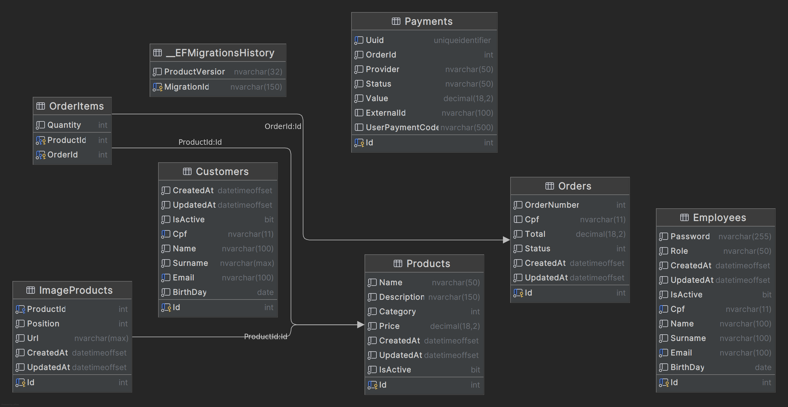
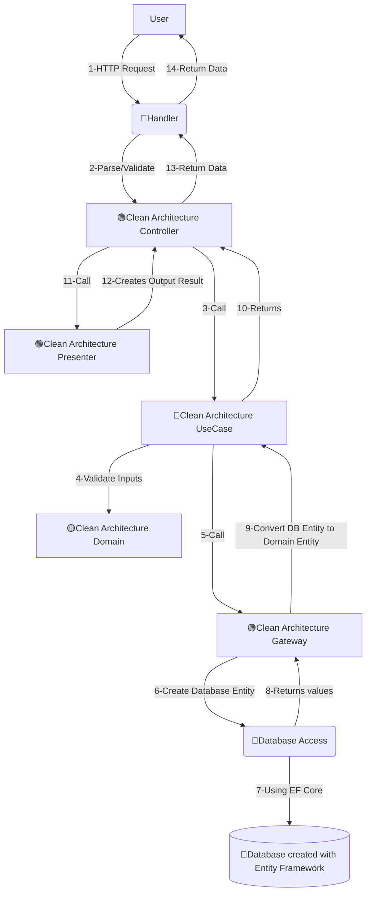
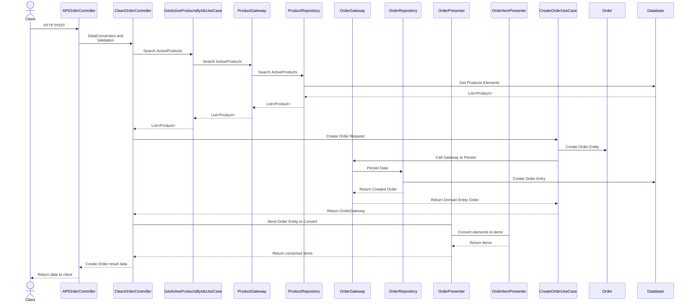

# Tech Challenge - Fast Food API - Grupo 118

[Projeto base para estudos](https://github.com/tuliorezende/practice-hexagon-architecture)

# Membros do Grupo
- Sabrina Cardoso de Oliveira
  - **Matrícula**: RM363507
  - **Usuário Discord**: sah.mdo
- Tiago Cristiano Koch
  - **Matrícula**: RM361415
  - **Usuário Discord**: tiagokoch0076
- Tiago Victor de Oliveira
  - **Matrícula**: RM364588
  - **Usuário Discord**: oliveirad.tiago
- Túlio Henrique de Paula Rezende
  - **Matrícula**: RM360982
  - **Usuário Discord**: tuliomamute
- Vinícius Rossmann Nunes
  - **Matrícula**: RM362963
  - **Usuário Discord**: _viniciusnunes

# Fase 1
## Miro
- [Clique aqui para acessar o Miro do Projeto](https://miro.com/app/board/uXjVIDgIqTM=/?share_link_id=224738363095)

## Notion
- [Clique aqui para acessar o Notion do Projeto](https://www.notion.so/1d25c6f7a32e8045949dd2c342b6a403?v=1d25c6f7a32e806bb165000c707b9a3d&pvs=4)

## Linguagem Ubíqua

- **Totem**: Terminal de Atendimento automatizado com o qual o cliente irá interagir, no modelo Wizard;
  - **Modelo Wizard**: Processo passo a passo que permitirá ao usuário escolher os itens do lanche por etapas e por tipo;
- **Cliente Identificado**: Cliente que informou seu CPF para prosseguir com o pedido;
- **Cliente Cadastrado**: Cliente que se cadastrou (Nome, Email e CPF) para receber conteúdos via email.

- **Pedido**: Agrupamento de um ou mais itens escolhidos pelo cliente para consumo;
- **Ingredientes**: Itens responsáveis para preparação de um Produto do Pedido.

- **Produto**: Itens que o cliente pode selecionar na montagem do Pedido;
  - **Lanche**: Primeiro tipo de Produto do Pedido que pode ser selecionado (um ou mais). É possível prosseguir com o pedido sem o Lanche;
  - **Acompanhamento**: Segundo tipo de Produto do Pedido que pode ser selecionado (um ou mais). É possível prosseguir com o pedido sem o Acompanhamento;
  - **Bebida**: Terceiro tipo de Produto do Pedido que pode ser selecionado (uma ou mais). É possível prosseguir com o pedido sem a Bebida;
  - **Sobremesa**: Quarto tipo de Produto do Pedido que pode ser selecionada (uma ou mais).

- **Status do Pedido**
  - **Recebido**: Pedido que teve seu pagamento efetuado e enviado para a cozinha;
  - **Em preparação**: Pedido que, após ter os ingredientes validados, foi iniciado o preparo;
  - **Pronto**: Pedido que teve seu preparo finalizado e está pronto para entrega ao cliente;
  - **Finalizado**: Pedido entregue ao cliente com sucesso.

- **Pagamento**: Operação efetivar a compra do Pedido;
- **QR Code**: Imagem a ser gerada pelo Totem para permitir o pagamento via PIX;
- **[SE] Mercado Pago**: Gateway de pagamento selecionado para a integração;
- **Comprovante**: Papel impresso pelo Totem ao final do pedido contendo um identificador amigavel para acompanhamento do andamento do pedido.

- **Cozinha**: Área responsável por efetuar a preparação do Pedido;
- **Balcão**: Área responsável por realizar a entrega do Pedido para o Cliente;
- **Telão**: Visualização que permitirá ao cliente ver a fila de Pedidos sendo Preparados e que estão Prontos;

## Tecnologias utilizadas
- **Linguagem**: C# / Asp.Net Core Web Api (dotnet 8)
- **Banco de Dados**: SQL Server 2022
- **ORM**: Entity Framework Core
  - **Migration** sendo aplicada no startup da aplicação
- **Controle de Versão**: GitHub

Escolhas efetuadas de acordo com a familiariade de todo o grupo para acelerarmos o tempo de desenvolvimento e focarmos nas atividades fundamentais

## Utilizando a autenticação
Inicialmente temos um usuário admin cadastrado, para validar as credenciais acesse no swagger o endpoint de Login, fornecendo as credenciais
```
email: admin@admin.com
password:  adminPass
```

Com isso deve ser gerado um token que deve ser fornecido no canto superior direito clicando no botão Authorize, adicionar a palavra Bearer e colar o conteúdo da resposta do endpoint Login, Ex: Bearer eyJhbGciOiJIUzI1NiIsI e clicar em Authorize. Após isso fechar clicar em close e seu usuário estará autenticado e com acesso a todos os endpoints da aplicação.

## Estrutura do Banco de Dados

Abaixo segue a modelagem do nosso banco de dados, contendo como as entidades se relacionam.



## Configuração
Para geração do qr code com o mercado pago, estão sendo utilizadas credenciais de sandbox. Para utilizar sua própria conta, basta atualizar
as variáveis de ambiemte com o prefixo "MercadoPago__" no docker-compose.yaml.

Por ainda não ser possível confirmar um pagamento pix em ambiente de sandbox, a simulação de confirmação pode ser feita através do endpoint /payment/{id}, informando o código do pagamento a ser confirmado.

## Como executar a aplicação
De maneira bem simplificada, nosso `docker-compose.yml` foi configurado para permitir que a partir de 2 comandos (ou até um, se apenas considerado a execução), a aplicação aparece online

- Navegue até o diretório raíz do repositório
  - Execute o comando `docker compose build`
    - Esse comando irá disparar o build multi-stage da nossa aplicação, em modo Release, possibilitando assim uma melhor performance no uso
  - Após o build, execute o comando `docker compose up -d`
    - Esse comando irá subir a nossa infraestrutura de:
      - Banco de Dados SQL Server
      - Aplicação
      - Volume para o banco de dados
      - Rede interna entre API e banco para acesso aos dados
      - HealthCheck do container
    - Após a inicialização, a aplicação estará acessível na seguinte URL: http://localhost:8080
      - A própria API cria e aplica as migrations, melhorando assim a experiência de uso do projeto

# Fase 2

## 1 - Helm - SQL Server

Para facilitar a instalação do SQL Server em um cluster Kubernetes, foi criado um [chart Helm](https://helm.sh/docs/intro/install/). O chart inclui as configurações necessárias para o banco de dados, como usuário, senha e porta.
Comando de instalação (a partir da pasta raiz do projeto)
```shell
helm upgrade --install sqlserver infra/helm/devsqlchart
```

Dados para acesso ao banco de dados

- **Usuário**: sa
- **Senha**: Mssql!Passw0rd
- **Host**: localhost, 31390 (porta do serviço NodePort)

Connection string de exemplo:
```plaintext
Data Source=localhost,31390;Database=TechChallengeFastFoodFase2;Integrated Security=false;User ID=sa;Password=Mssql!Passw0rd;TrustServerCertificate=true;Max Pool Size=200;Min Pool Size=10;Connection Timeout=30;
```

## 2 - Helm - API

### Image Build (from the root of the project)

```bash
docker build . -f src/CleanArchitecture/Infrastructure/TechChallengeFastFood.CleanArch.Infrastructure.API/Dockerfile -t fiaptechchallengelocal/techchallengefastfoodapi118fase2:latest -t fiaptechchallengelocal/techchallengefastfoodapi118fase2:1.0.0
```

### Deploy with no secrets or config (from the root of the project)

```bash
helm upgrade --install techchallengefastfoodapi118fase2 infra/helm/techchallengefastfoodapi118fase2
```

## Data Flow Diagram


## Order Sequence Diagram
